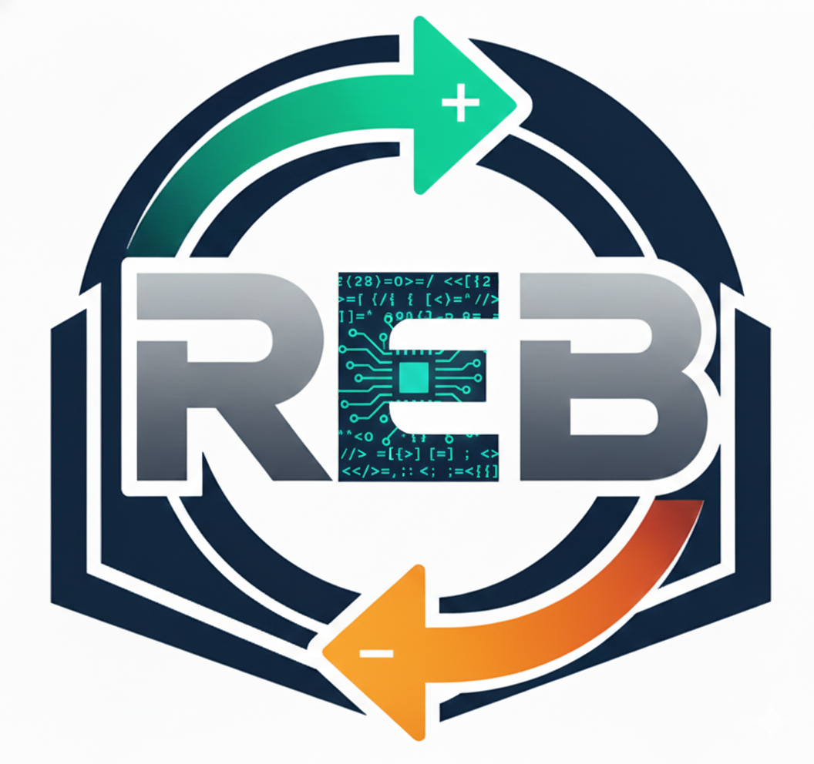
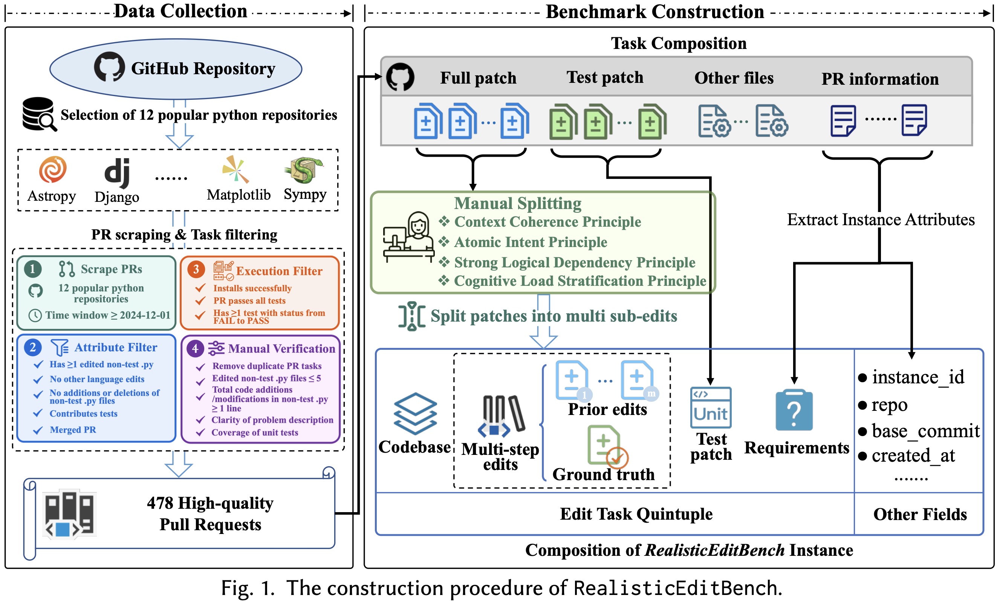

<div align="center">
  <h1 align="center"> RealisticEditBench: Towards Real-World Project-Level Incremental Code Editing Evaluation</h1>
</div>

<div align="center">
    <a href="https://github.com/Anonymity-hub/RealisticEditBench">
        
    </a>
    <a href="./crawled_data">
        
    </a>
    <a href="https://realisticeditbench.github.io/">
        
    </a>
    <a href="https://www.python.org/">
    
  </a>
  <a href="LICENSE">
    
  </a>
    <hr>
</div>

## 🆕 News

- **[2025-01-30]**: 🎉 We are excited to announce the release of **RealisticEditBench**! You can access the dataset on [here](./crawled_data) and start evaluating your models!


## 🎯 Overview

**RealisticEditBench** is a benchmark for evaluating large language models on **real-world incremental code editing tasks** collected from GitHub pull requests. Unlike traditional benchmarks that focus on isolated code generation or bug fixing, RealisticEditBench challenges models to perform **incremental code edits** that reflect how developers actually modify code in production environments.

Given a *codebase*, a *task description* (from PR/issue), and *previous edit history*, a language model is tasked with generating a *patch* that correctly implements the required changes in the context of existing code modifications.

<p align="center">
  
</p>

### Key Features

- **Incremental Editing**: Tasks require models to understand and build upon previous code changes, simulating real-world development workflows
- **Project-Level Context**: Each task includes relevant codebase context, requiring models to reason about project structure and dependencies
- **Real-World Tasks**: All instances are collected from actual GitHub pull requests across diverse open-source projects
- **Comprehensive Evaluation**: Supports both execution-based testing and code similarity metrics
- **Docker-Based Evaluation**: Reproducible evaluation harness using Docker containers

## ⚡ Quick Start

### 1. Installation

```bash
git clone https://github.com/Anonymity-hub/RealisticEditBench.git
cd RealisticEditBench
pip install -e .
```

### 2. Environment Setup

RealisticEditBench uses Docker for reproducible evaluations. Follow the [Docker setup guide](https://docs.docker.com/engine/install/) to install Docker on your machine.

> [!WARNING]
> **System Requirements**
> 
> - RealisticEditBench evaluation currently **does not support Windows**.
> - Some Docker environments may not work properly on Mac M-series (ARM64) architectures.
> - To ensure all environments can be set up successfully, we **recommend using Ubuntu 22.04 on x86_64 architecture**.

### 3. Access the Dataset

To access RealisticEditBench, you can load the dataset from the local files:

```python
from editbench.utils.dataset_utils import get_inf_datasets

# Load the benchmark dataset
dataset = get_inf_datasets("crawled_data/bench/all-task-instances.jsonl")
```

### 4. Run Evaluation

Evaluate patch predictions on RealisticEditBench with the following command:

```bash
python -m editbench.evaluation.run_evaluation run \
    --dataset_name "all" \
    --predictions_path 'gold' \
    --max_workers 2 \
    --run_id "0.2"
```

> [!NOTE]
> For detailed usage instructions, see the [Evaluation Guide](editbench/evaluation/README.md).

## 📖 Documentation

RealisticEditBench is organized into several modules, each with its own documentation:

- **[Collection](editbench/collection/README.md)**: Data collection pipeline for gathering real-world code editing tasks from GitHub
- **[Editing Split](editbench/editing_split/README.md)**: Tools for splitting and validating incremental code edits
- **[Inference](editbench/inference/README.md)**: Run inference with various language models and generate predictions
- **[Evaluation](editbench/evaluation/README.md)**: Comprehensive evaluation harness with Docker-based testing

## 💻 Usage

### Running Inference

Generate predictions for your model:

```bash
python -m editbench.inference.run_api \
    --model gpt-5-codex \
    --dataset_name all \
    --run_id "0.2"
```

### Evaluating Predictions

Evaluate your model's predictions:

```bash
python -m editbench.evaluation.run_evaluation run \
    --dataset_name "all" \
    --model gpt-5-codex \
    --max_workers 2 \
    --run_id "0.2"
```

> [!WARNING]
> RealisticEditBench evaluation can be resource intensive. We recommend running on a machine with at least 120GB of free storage, 16GB of RAM, and 8 CPU cores.

## 📦 Dataset

The benchmark includes:

- **Main Benchmark**: [`crawled_data/bench/all-task-instances.jsonl`](./crawled_data/bench/all-task-instances.jsonl) - Full benchmark dataset
- **Inference Variants**: Multiple variants in [`crawled_data/infbench/`](./crawled_data/infbench) with different context configurations:
  - Different information percentages (0.2, 0.4, 0.6, 0.8)
  - BM25 retrieval variants
  - With/without issue body

## 🏗️ Project Structure

```
RealisticEditBench/
├── editbench/              # Main package
│   ├── collection/         # Data collection tools
│   ├── editing_split/      # Edit splitting and validation
│   ├── inference/          # Model inference
│   ├── evaluation/         # Evaluation harness
│   └── utils/              # Utility functions
├── crawled_data/           # Benchmark datasets
│   ├── bench/              # Main benchmark
│   └── infbench/           # Inference variants
├── patch_histories/        # Historical patch data
└── assets/                 # Project assets
```

## 🤝 Contributions

We welcome contributions from the research community! Please feel free to file issues or submit pull requests.

<!-- ## 📑 Citation

If you find RealisticEditBench helpful for your research, please cite:

```bibtex
@article{realisticeditbench2025,
  title={RealisticEditBench: Towards Real-World Project-Level Incremental Code Editing Evaluation},
  author={Anonymous},
  journal={arXiv preprint},
  year={2025}
}
``` -->

## ⚖️ License

MIT License. See [LICENSE](LICENSE) for details.
