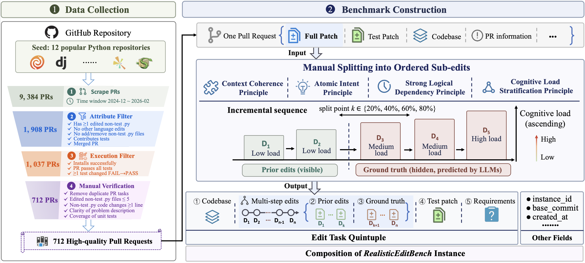

<div align="center">
  <h1 align="center">RealisticEditBench: Towards Real-World Project-Level Incremental Code Editing Evaluation</h1>
</div>

<div align="center">
    <a href="https://github.com/Anonymity-hub/RealisticEditBench">
        
    </a>
    <a href="https://realisticeditbench.github.io">
        
    </a>
    <a href="#dataset">
        
    </a>
    <a href="https://realisticeditbench.github.io/leaderboard.html">
        
    </a>
    <a href="https://www.python.org/">
    
  </a>
  <a href="LICENSE">
    
  </a>
    <hr>
</div>

## News

- **[2026-06-30]** — Released an updated benchmark with **712** instances. See [Dataset](#dataset) and the module guides below.
- **[2026-02-03]** — [Leaderboard](https://realisticeditbench.github.io/) is live. Submit PRs to add your model results.
- **[2026-01-30]** — Initial release.

---

## Overview

**RealisticEditBench** evaluates LLMs on **incremental code editing** from real GitHub pull requests. Each task provides a codebase, optional PR/issue context, and prior edit history; the model must produce the next patch in sequence.

<p align="center">
  
</p>

| | |
|---|---|
| **712 instances** | Curated PRs across astropy, django, matplotlib, sympy, xarray, scikit-learn, sphinx, pylint, … |
| **Incremental edits** | Step-wise `work_patch_list`; infbench splits history vs. `ground_truth` |
| **Docker evaluation** | Apply patch → run project tests → resolved / similarity metrics |
| **Variants** | Info ratios 0.2–0.8, BM25 context, with/without issue body |

---

## Quick Start (run evaluation)

Most users only need this path: clone → install → pull LFS data → run gold or model evaluation.

### 1. Clone and fetch dataset (Git LFS)

Large JSONL files are stored with **Git LFS**. After cloning, pull them before running evaluation or inference:

```bash
git clone https://github.com/Anonymity-hub/RealisticEditBench.git
cd RealisticEditBench
git lfs install
git lfs pull
```

> [!IMPORTANT]
> Without LFS, `crawled_data/bench/` and `crawled_data/infbench/` files are tiny pointer stubs (~130 bytes), not real JSONL. The loader will try `git lfs pull` automatically when possible, but **`git-lfs` must be installed**.

Verify a file is real data (expect tens or hundreds of MB, not ~130 bytes):

```bash
ls -lh crawled_data/infbench/all-task-instances_0.2.jsonl
```

### 2. Install the package

Use **Python 3.10, 3.11, or 3.12** (3.13 is not supported).

```bash
pip install -e .
```

If `pip install` fails building `tree-sitter` or `editdistance`, install a C/C++ toolchain first (e.g. on Ubuntu: `sudo apt install build-essential`).

### 3. Docker

Evaluation requires Docker. See the [Docker install guide](https://docs.docker.com/engine/install/).

> [!WARNING]
> **Platform**
> - Windows is **not** supported for evaluation.
> - Mac ARM (M-series) may have Docker compatibility issues.
> - Recommended: **Ubuntu 22.04 x86_64**, ≥120 GB disk, 16 GB RAM, 8 CPU cores.

### 4. Gold evaluation (oracle upper bound)

Uses `ground_truth` from infbench — no API keys required:

```bash
python -m editbench.evaluation.run_evaluation run \
    --dataset_name all \
    --predictions_path gold \
    --run_id 0.2 \
    --max_workers 2
```

Details: [Evaluation guide](editbench/evaluation/README.md).

### 5. Model inference + evaluation (optional)

Create `.env` in the repo root (see [Inference guide](editbench/inference/README.md)):

```bash
OPENAI_KEYS=your-api-key
```

```bash
# Generate predictions
python -m editbench.inference.run_api \
    --model your-model-name \
    --dataset_name all \
    --run_id 0.2

# Evaluate predictions
python -m editbench.evaluation.run_evaluation run \
    --dataset_name all \
    --model your-model-name \
    --run_id 0.2 \
    --max_workers 2
```

---

## Reproducing workflows

| Goal | Path | Guide |
|------|------|--------|
| **Run models on the 712-instance benchmark** | Quick Start above | This README + [Inference](editbench/inference/README.md) + [Evaluation](editbench/evaluation/README.md) |
| **Inspect or rebuild data from GitHub PRs** | collection → editing_split → gather_bench → … | [Collection](editbench/collection/README.md) → [Editing Split](editbench/editing_split/README.md) |
| **Refine step-wise patch splits** | `scripts/pr_subedit_instance.py` + `skills/` | [Editing Split](editbench/editing_split/README.md) |

---

## Load data in Python

**Bench** (`crawled_data/bench/`) holds full task metadata and `work_patch_list`.  
**Infbench** (`crawled_data/infbench/`) adds `prompt`, `pre_edits`, and `ground_truth` for inference/evaluation.

```python
from editbench.utils.dataset_utils import get_inf_datasets

# For evaluation / inference (has ground_truth)
instances = get_inf_datasets("crawled_data/infbench/all-task-instances_0.2.jsonl")
print(len(instances), instances[0].instance_id)

# Bench only (metadata + patch history, no ground_truth split)
bench = get_inf_datasets("crawled_data/bench/all-task-instances.jsonl")
```

---

<a id="dataset"></a>
## Dataset

**712** task instances:

| Asset | Path | In repo | Notes |
|-------|------|---------|--------|
| Bench | `crawled_data/bench/all-task-instances.jsonl` | Yes (LFS) | Full `work_patch_list` per instance |
| Infbench | `crawled_data/infbench/all-task-instances_{run_id}.jsonl` | Yes (LFS) | `run_id`: `0.2`, `0.4`, `0.6`, `0.8`, `0.2_bm25_*`, `0.2_body_issue`, … |
| Patch histories | `patch_histories/{instance_id}/` | Yes | Step-wise diffs used to build bench |
| Activity / execution-filter intermediates | `crawled_data/activity/`, `activity_execution/` | No | Produced locally if you run the [collection pipeline](editbench/collection/README.md) |

> [!NOTE]
> Dataset files are hosted in this repository via Git LFS. A Hugging Face mirror may be added later.

---

## Documentation

| Module | Description |
|--------|-------------|
| [Collection](editbench/collection/README.md) | Collect PRs, execution-filter, gather bench, merge |
| [Editing Split](editbench/editing_split/README.md) | Split patches, validate, `pr_subedit_instance.py`, `skills/` |
| [Inference](editbench/inference/README.md) | `prompt_builder`, `run_api`, prediction layout |
| [Evaluation](editbench/evaluation/README.md) | Docker harness, gold/model eval, summary |

---

## Project structure

```
RealisticEditBench/
├── editbench/                 # Python package
│   ├── collection/            # Data collection
│   ├── editing_split/         # Patch splitting & validation
│   ├── inference/             # Model inference
│   ├── evaluation/            # Docker evaluation
│   └── utils/                 # Shared utilities (incl. merge_utils, LFS helpers)
├── crawled_data/
│   ├── bench/                 # ★ In repo (LFS): 712-instance benchmark
│   ├── infbench/              # ★ In repo (LFS): inference/eval variants
│   ├── activity/              # Generated locally: from run_collection
│   └── activity_execution/    # Generated locally: from execute_filter
├── patch_histories/           # ★ In repo: per-instance step-wise splits
├── scripts/                   # pr_subedit_instance.py (agent-assisted splitting)
├── skills/                    # PR sub-edit principles & workflow
├── experiment_results/        # Local: eval/inference outputs (gitignored)
└── assets/
```

★ = included when you clone + `git lfs pull`.

---

## Contributions

Issues and pull requests are welcome.

## License

MIT — see [LICENSE](LICENSE).
